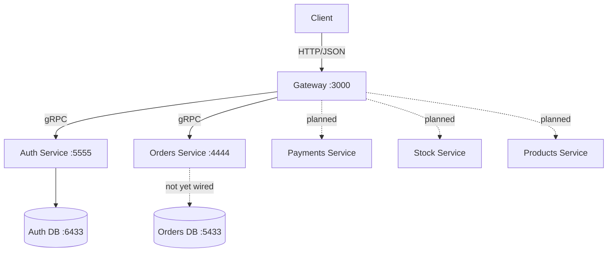
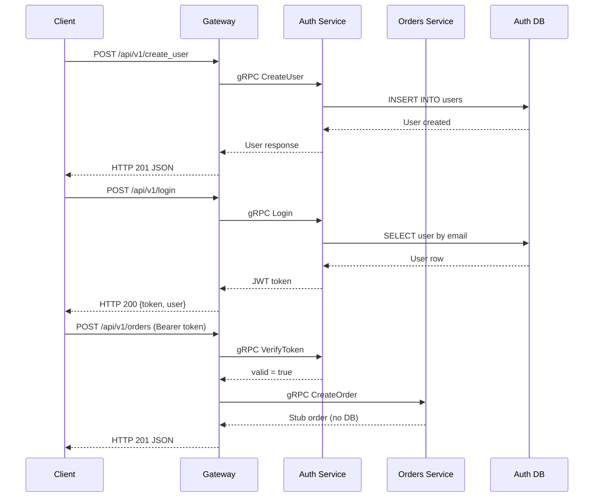
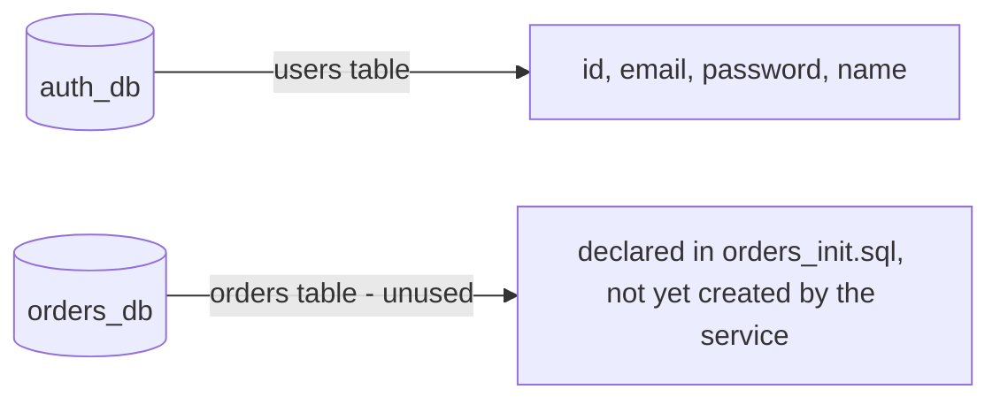

# Architecture

## System Overview

Solid lines are implemented today; dashed lines are planned. The Payments and Stock services are scaffolds (no Go source, no containers). The Products service has DB models and a gRPC handler stub but no server entrypoint, Dockerfile, or DB wiring yet, and no container. Their databases do not exist yet. The Orders service runs but does not yet connect to `orders-db`.

## Request Flow

## Data Layer

- `auth_db` (`:6433`) is created by `scripts/auth_init.sql` and used by the Auth service.
- `orders_db` (`:5433`) has a running, healthchecked container, but `scripts/orders_init.sql` is empty and the Orders service does not connect to it yet.
- `payments_db` and `stock_db` are planned and do not exist.

## Services

| Service | Port | Protocol | Database | Purpose |
|---------|------|----------|----------|---------|
| Gateway | 3000 | HTTP/JSON | — | Public API entrypoint; gRPC client to Auth/Orders; JWT auth middleware on protected routes |
| Auth | 5555 | gRPC | :6433 | User creation, authentication, token verification, user lookup |
| Orders | 4444 | gRPC | :5433 (unused) | Order creation (stub) and retrieval (unimplemented) |
| Payments | — | gRPC (planned) | — (planned) | Payment processing (scaffold) |
| Stock | — | gRPC (planned) | — (planned) | Inventory management (scaffold) |
| Products | — | gRPC (planned) | — (planned) | Product catalog management (db + handler stubs, no server/Dockerfile) |
