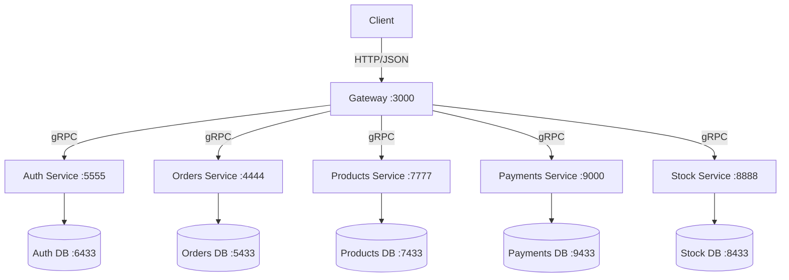
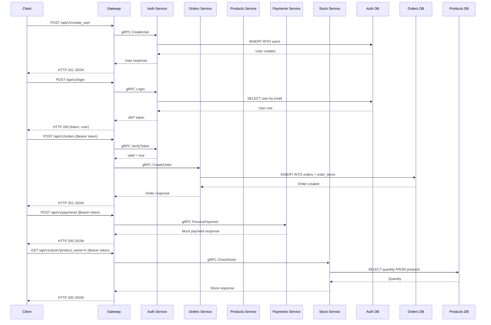
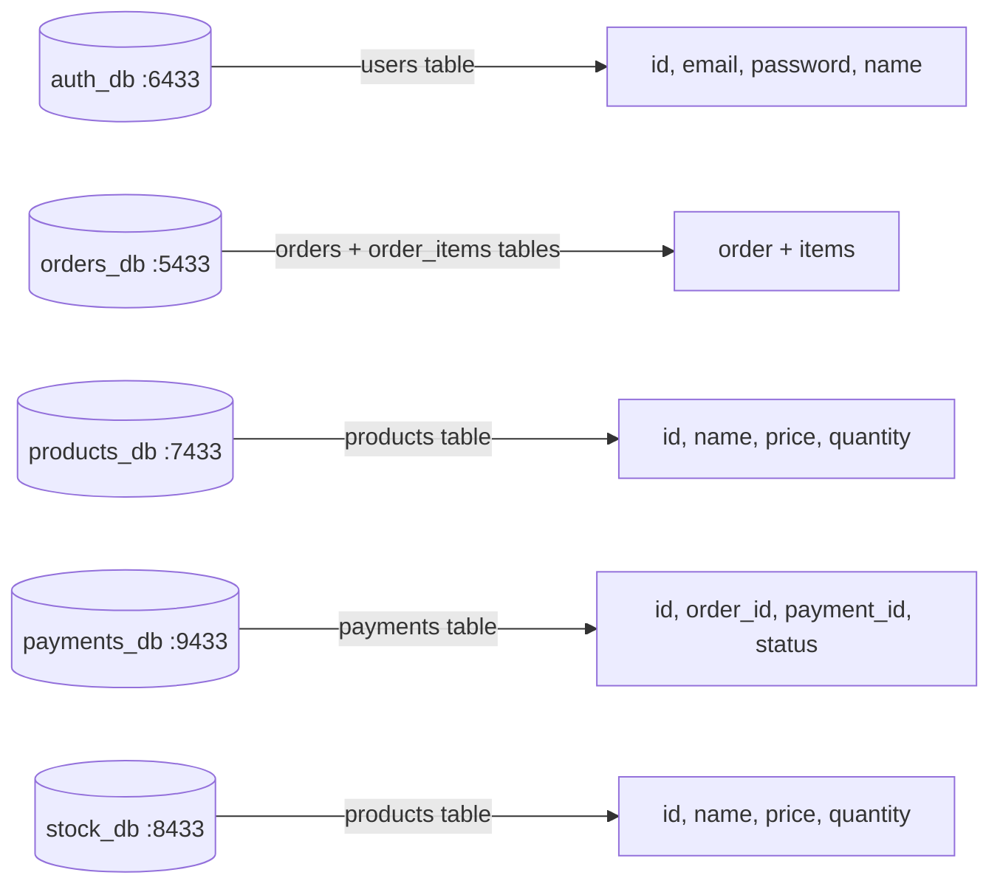

# Architecture

## System Overview

All services are implemented and connected. The Gateway exposes HTTP/JSON endpoints and proxies requests to all backend gRPC services. Each service has its own dedicated PostgreSQL database.

## Request Flow

## Data Layer

- `auth_db` (`:6433`) — created by `scripts/auth_init.sql`, used by the Auth service
- `orders_db` (`:5433`) — created by `scripts/orders_init.sql`, used by the Orders service
- `products_db` (`:7433`) — created by `scripts/products_init.sql`, used by the Products service
- `payments_db` (`:9433`) — created by `scripts/payments_init.sql`, used by the Payments service
- `stock_db` (`:8433`) — created by `scripts/stock_init.sql`, used by the Stock service

## Services

| Service | Port | Protocol | Database | Purpose |
|---------|------|----------|----------|---------|
| Gateway | 3000 | HTTP/JSON | — | Public API entrypoint; gRPC client to all backend services; JWT auth middleware on protected routes |
| Auth | 5555 | gRPC | :6433 | User creation, authentication, token verification, user lookup |
| Orders | 4444 | gRPC | :5433 | Order creation with DB persistence, order retrieval, product stock check |
| Products | 7777 | gRPC | :7433 | Product catalog management with DB-backed handlers |
| Payments | 9000 | gRPC | :9433 | Mock payment processing with success/failure logic |
| Stock | 8888 | gRPC | :8433 | Inventory management with stock check and reservation |
