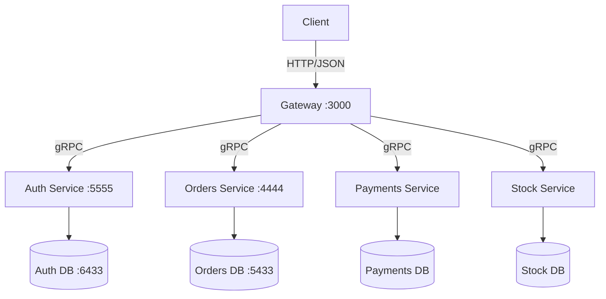
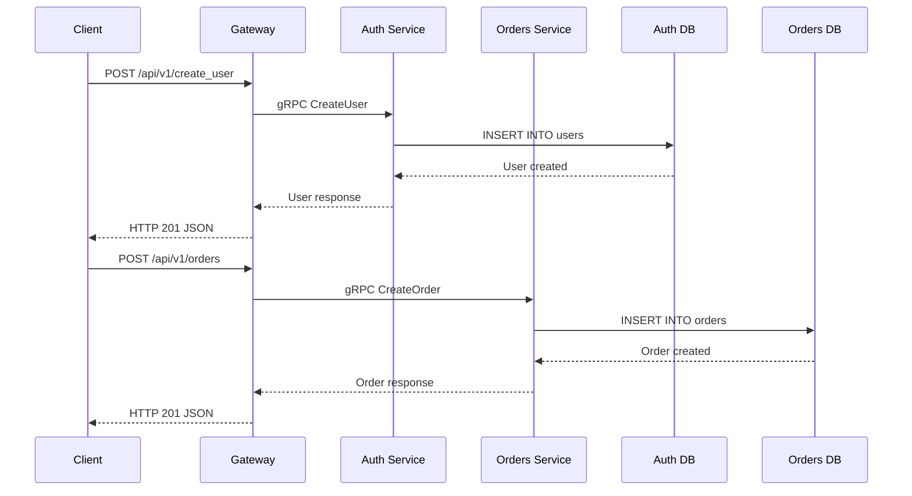
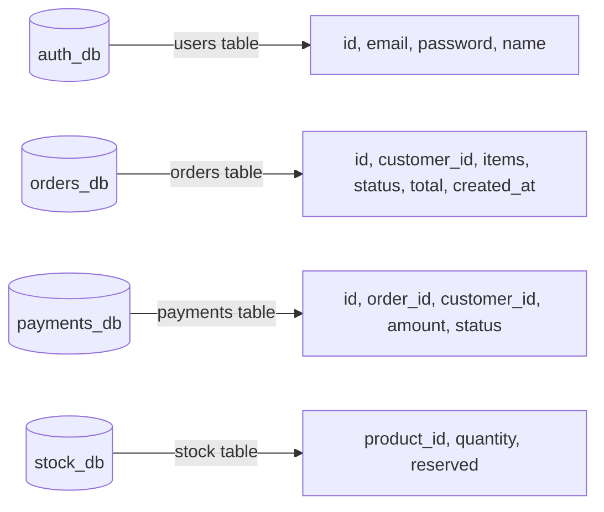

# Architecture

## System Overview

## Request Flow

## Data Layer

## Services

| Service | Port | Protocol | Database | Purpose |
|---------|------|----------|----------|---------|
| Gateway | 3000 | HTTP/JSON | — | Public API entrypoint |
| Auth | 5555 | gRPC | :6433 | User creation and authentication |
| Orders | 4444 | gRPC | :5433 | Order creation and retrieval |
| Payments | — | gRPC | — | Payment processing |
| Stock | — | gRPC | — | Inventory management |
